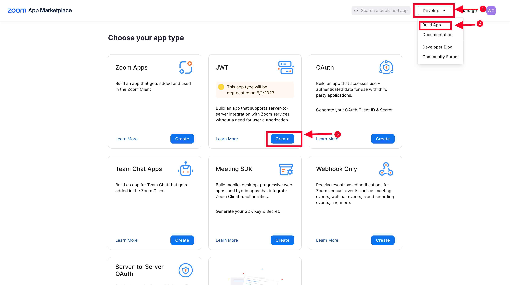
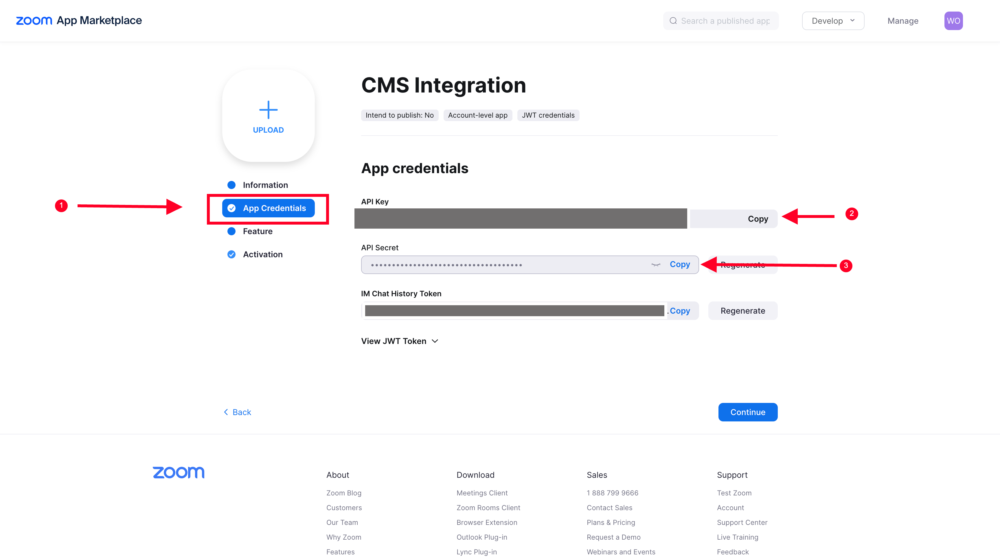

# Wagtail Zoom Integration

Integrate Zoom in Wagtail Projects

# Features

- Integrate Zoom Events (meetings or webinars) registration to form pages created with `Wagtail Form Builder`
    - Benefit - Automatically add event registrants to a Zoom event on registering from your website. Zoom will send
      them emails and reminders so that you don't have to do it.

# Installation

Install from pip

```bash
pip install wagtail-zoom-integration
```

Add `wagtailzoom` to your installed apps. Make sure `wagtail.contrib.settings` is also added

```python
 INSTALLED_APPS = [
    ...
    "wagtailzoom",
    "wagtail.contrib.settings",
    ...
]
```

Run migrations

```bash
python manage.py migrate wagtailzoom
```

# Usage

### Settings

A `Zoom settings` section will be added to the `Settings` section on the Wagtail Admin.


The steps below explain how to configure the Zoom settings, as shown on the screenshot above

1. Click on Settings
2. Select Zoom Settings
3. Add the Zoom API Key. See next section on how to obtain the API Key.
4. Add the Zoom API Secret. See next section on how to obtain the API Secret.
5. Save

### Obtaining Zoom API Key and API Secret

`Note`: The Zoom Account user that generates the API credentials should have the permissions to:

- Read and write meetings
- Read and write webinars

First, log into [marketplace.zoom.us](https://marketplace.zoom.us)



After logging into [marketplace.zoom.us](https://marketplace.zoom.us), the interface will appear similar to above
screenshot

Follow the steps below to create a JWT app, to get the API credentials:

1. Go to the 'Develop' dropdown button right next to the manage button,
2. Click 'Build App'
3. On the 'Choose your app' type page, click `Create` from within the JWT box

- A modal will appear to name your app — name your app and proceed.

- On the next page, under Information, fill out a Company Name, Developer Name, and Developer Email.



1. Once completed filling company details, your API Key and Secret will be generated automatically under the App
   Credentials tab
2. Copy the API key, and add to the Zoom settings in the Wagtail Admin
3. Copy the API Secret. and add to the Zoom Settings in the Wagtail Admin

### Integrating Zoom Meeting/Webinar registration to custom form pages

#### Use Case

- You have a single-page form that
  uses [Wagtail Form Builder](https://docs.wagtail.org/en/latest/reference/contrib/forms/).
- You use the form builder to build custom form pages for collecting user information, say registrants to a
  workshop/event.
- You use Zoom as the video conferencing solution.
- You want to add users who register for your event, from your website, to the Zoom Meeting/Webinar, and you want Zoom
  to manage sending your registrants meeting and follow-up emails

You can follow the following snippet to achieve the above:

```python
# models.py
from django.db import models
from modelcluster.fields import ParentalKey
from wagtail.admin.panels import InlinePanel
from wagtail.contrib.forms.models import AbstractFormField
from wagtail.models import Page

from wagtailzoom.models import AbstractZoomIntegrationForm


class HomePage(Page):
    pass


class FormField(AbstractFormField):
    page = ParentalKey('EventRegistrationPage', on_delete=models.CASCADE, related_name='form_fields')


class EventRegistrationPage(AbstractZoomIntegrationForm):
    parent_pages = ["home.HomePage"]
    template = 'event_registration_page.html'
    landing_page_template = 'form_thank_you_landing.html'

    content_panels = Page.content_panels + AbstractZoomIntegrationForm.integration_panels + [
        InlinePanel('form_fields', label="Form fields"),
    ]

```

You can find this code snippet implemented in `sandbox/home/models.py`

Run your migrations, and create the page from the Wagtail Admin Explorer.

The editor form will look similar to below:


1. Select the Zoom Event you want to integrate. This is a dropdown of the latest meetings and webinars created
2. Create your form fields, according to the information you want to collect from your registrants. The fields that must
   be included are:
    - Email - with field type `email`
    - First Name - with field type `single line text`
    - Last Name - with field type `single line text`

Save and `Publish` your page.

Go back to the Wagtail Admin Explorer, and locate where the page you created is listed. Hover around the page title, and
you will see a button named `Zoom Integration` as below


Click it, and it will open a page, where you will match the Zoom required form fields `(Email, First Name, Last Name)`,
with the fields in your form.


Make sure you do the matching correctly as this will inform Zoom on how to extract the required user data from your
Custom form. If not set, or not correctly set, the integration will not work.

Save the integration form.

If done correctly, new registrants will be added to Zoom on submission of the form page.

You can try adding a user to make sure everything works, before sharing your page with your users.


