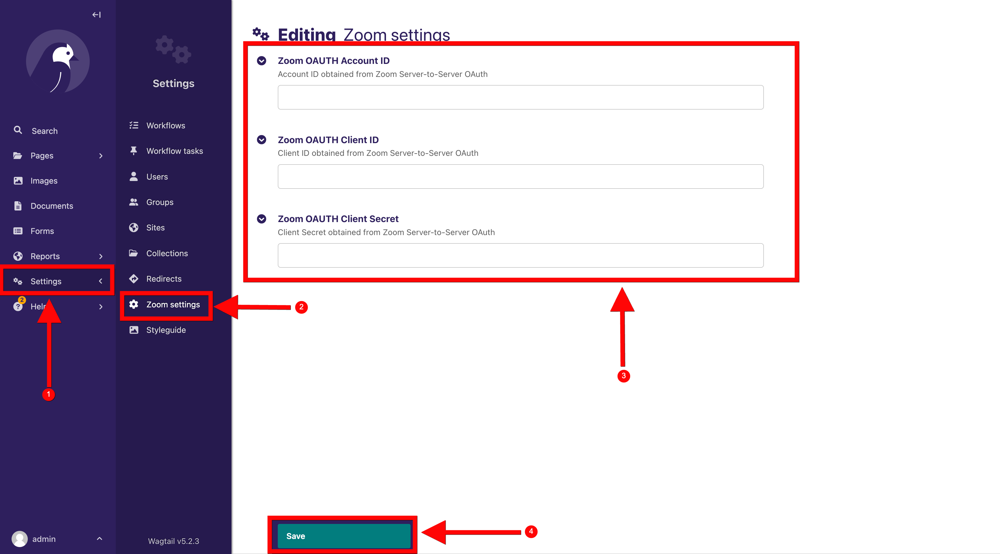
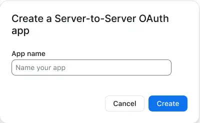
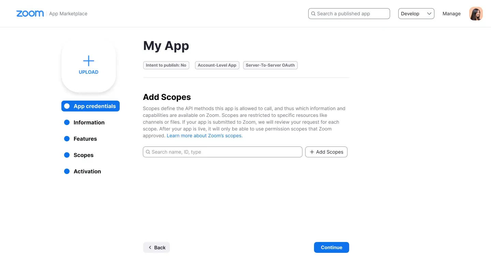
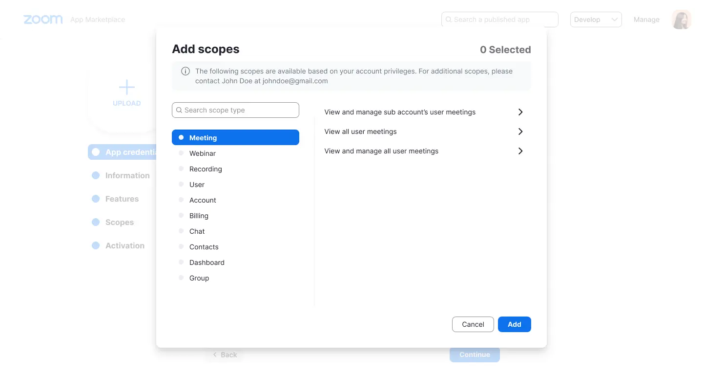
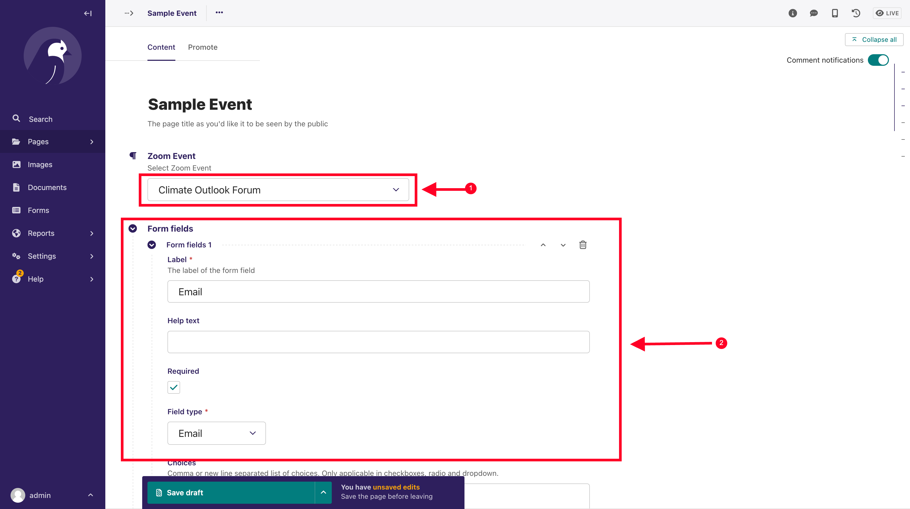
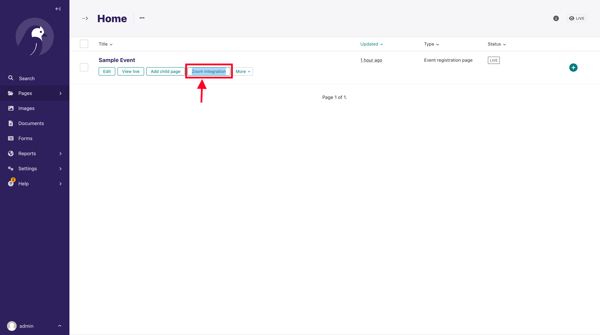
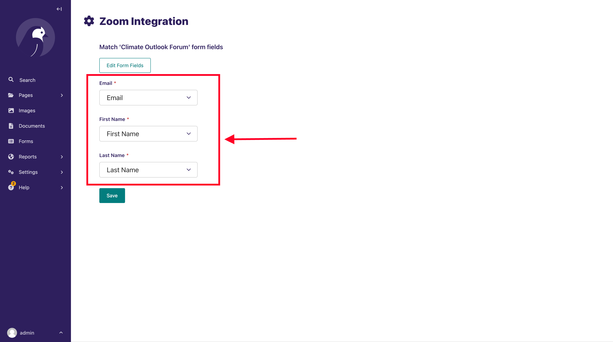

# Wagtail Zoom Integration

Integrate Zoom in Wagtail Projects

# Features

- Integrate Zoom Events (meetings or webinars) registration to form pages created with `Wagtail Form Builder`
    - Benefit - Automatically add event registrants to a Zoom event on registering from your website. Zoom will send
      them emails and reminders so that you don't have to do it.

# Installation

Install from pip

```bash
pip install wagtail-zoom-integration
```

Add `wagtailzoom` to your installed apps. Make sure `wagtail.contrib.settings` is also added

```python
 INSTALLED_APPS = [
    ...
    "wagtailzoom",
    "wagtail.contrib.settings",
    ...
]
```

Run migrations

```bash
python manage.py migrate wagtailzoom
```

# Usage

### Settings

A `Zoom settings` section will be added to the `Settings` section on the Wagtail Admin.



The steps below explain how to configure the Zoom settings, as shown on the screenshot above

1. Click on Settings
2. Select Zoom Settings
3. Add the Zoom OAUTH Account ID, OAUTH Client ID and OAUTH Client Secret . See next section on how to create and obtain
   these credentials from Zoom.
5. Save

### Create a Server-to-Server OAuth app

The account administrator or a developer with permissions to create server-to-server OAuth apps can create these apps in
an account.

#### Prerequisites

- [A Zoom account](https://support.zoom.us/hc/en-us/articles/360034967471-Getting-started-guide-for-new-users)
- [Permissions to view and edit server-to-server OAuth apps](https://developers.zoom.us/docs/internal-apps/#enable-the-server-to-server-oauth-role)
- [Permissions for scopes that you will add to the app](https://developers.zoom.us/docs/internal-apps/#assign-permissions-to-access-scopes)

#### Steps to create a Server-to-Server OAuth app

1. Go to the [Zoom App Marketplace](https://marketplace.zoom.us/). Click Develop in the dropdown menu in the top-right
   corner of the page and select **Build Server-to-Server App**.

2. Add a name for your app and click **Create**.



3. **App credentials**: View your account ID, client ID and client secret. You'll use these credentials to authenticate
   with Zoom.
4. **Information:** Add information about your app, such as a short description, company name, and developer contact
   information (name and email address required for activation).
5. **Feature:** Toggle whether you’d like to enable event subscriptions. If enabled, choose the event subscriptions
   you'd like to use. See Using Zoom Webhooks for details.
6. **Scopes:** Scopes define the API methods this app is allowed to call, and thus which information and capabilities
   are available on Zoom. You should limit the scopes you request to only those needed by your app.
   See [OAuth scopes](https://developers.zoom.us/docs/internal-apps/oauth-scopes-overview/) to learn more.



Choose **Add Scopes** to search for and add scopes:



7. **Activation:** Your app should be activated. If you see errors that prevent activation, please address them. You
   will not be able to generate an access token to make API calls unless your app is activated. If your app is
   deactivated, existing tokens will no longer work.

### Get app credentials

**App credentials** are the client credentials, including the **account ID, client ID, and client secret**, which Zoom
provides to app developers to access the Zoom platform. You can get these credentials for the detail page of your app in
the Zoom App Marketplace.

More information on how to get the app credentials can be
found [here](https://developers.zoom.us/docs/internal-apps/create/)

### Integrating Zoom Meeting/Webinar registration to custom form pages

#### Use Case

- You have a single-page form that
  uses [Wagtail Form Builder](https://docs.wagtail.org/en/latest/reference/contrib/forms/).
- You use the form builder to build custom form pages for collecting user information, say registrants to a
  workshop/event.
- You use Zoom as the video conferencing solution.
- You want to add users who register for your event, from your website, to the Zoom Meeting/Webinar, and you want Zoom
  to manage sending your registrants meeting and follow-up emails

You can follow the following snippet to achieve the above:

```python
# models.py
from django.db import models
from modelcluster.fields import ParentalKey
from wagtail.admin.panels import InlinePanel
from wagtail.contrib.forms.models import AbstractFormField
from wagtail.models import Page

from wagtailzoom.models import AbstractZoomIntegrationForm


class HomePage(Page):
    pass


class FormField(AbstractFormField):
    page = ParentalKey('EventRegistrationPage', on_delete=models.CASCADE, related_name='form_fields')


class EventRegistrationPage(AbstractZoomIntegrationForm):
    parent_pages = ["home.HomePage"]
    template = 'event_registration_page.html'
    landing_page_template = 'form_thank_you_landing.html'

    content_panels = Page.content_panels + AbstractZoomIntegrationForm.integration_panels + [
        InlinePanel('form_fields', label="Form fields"),
    ]

```

You can find this code snippet implemented in `sandbox/home/models.py`

Run your migrations, and create the page from the Wagtail Admin Explorer.

The editor form will look similar to below:



1. Select the Zoom Event you want to integrate. This is a dropdown of the latest meetings and webinars created
2. Create your form fields, according to the information you want to collect from your registrants. The fields that must
   be included are:
    - Email - with field type `email`
    - First Name - with field type `single line text`
    - Last Name - with field type `single line text`

Save and `Publish` your page.

Go back to the Wagtail Admin Explorer, and locate where the page you created is listed. Hover around the page title, and
you will see a button named `Zoom Integration` as below



Click it, and it will open a page, where you will match the Zoom required form fields `(Email, First Name, Last Name)`,
with the fields in your form.



Make sure you do the matching correctly as this will inform Zoom on how to extract the required user data from your
Custom form. If not set, or not correctly set, the integration will not work.

Save the integration form.

If done correctly, new registrants will be added to Zoom on submission of the form page.

You can try adding a user to make sure everything works, before sharing your page with your users.


